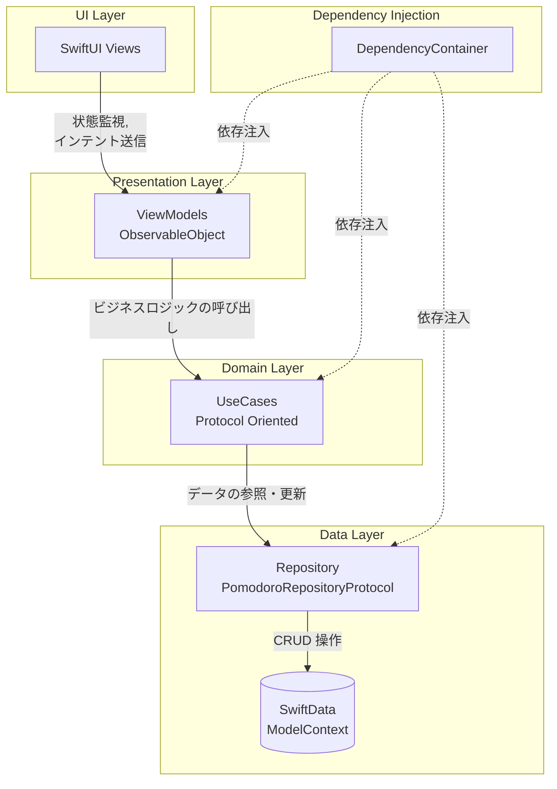

# Pomodoro iOS

このリポジトリは iOS 向けのポモドーロタイマーアプリです。

## アプリケーションアーキテクチャ (Architecture)

当アプリは、**MVVM (Model-View-ViewModel)** に **Clean Architecture** の要素（UseCase, Repository）を取り入れたレイヤードアーキテクチャを採用しています。

### レイヤー構成の役割
1. **UI Layer (Views)**
   - SwiftUI で構築されています。ViewModelの状態(`@Published`)を監視し、描画を行います。
2. **Presentation Layer (ViewModels)**
   - Viewからユーザーの入力を受け取り、UseCaseへ処理を移譲します。結果を状態として保持しViewに反映させます。
3. **Domain Layer (UseCases)**
   - ビジネスロジック（タイマーの制御やゴール到達の判定など）を担当します。プロトコル(`Protocol`)を通じて抽象化されています。
4. **Data Layer (Repository / Models)**
   - データの永続化には **SwiftData** を使用しています。`PomodoroRepositoryProtocol` を介してデータアクセス層を抽象化し、UseCase が特定のデータソース実装に依存しないようにしています。
5. **Dependency Injection (Core)**
   - `DependencyContainer` によってアプリ全体のインスタンス生成と依存注入 (DI) を一元管理しています。

---

## 課題点 (Current Issues)

コードベースを調査した結果、いくつかの課題点が見受けられます。

1. **バックグラウンド時のタイマー動作 (iOSのライフサイクルへの対応)**
   - **現状**: `TimerUseCase` にて `Timer.publish` を利用し、1秒ごとに `remainingSeconds` を減算する実装になっています。
   - **課題**: iOSではアプリがバックグラウンドに移行するとプロセスがサスペンドされ、毎秒のタイマー処理が停止します。結果として、アプリを再度開いたときに時間がずれてしまう・タイマーが正しく進まない問題が発生します。
2. **SwiftData のスレッド安全性**
   - **現状**: `PomodoroRepository` は単一の `ModelContext` を保持して動作しています。
   - **課題**: SwiftData の `ModelContext` はスレッドセーフではなく、生成されたスレッド（一般的にはメインスレッド）でのみアクセスする必要があります。将来的に非同期処理や別スレッドからデータ保存を行おうとした際に、クラッシュする危険性があります。
3. **DIコンテナのテスト容易性と拡張性**
   - **現状**: `DependencyContainer` がシングルトンとして実装されています。
   - **課題**: UseCaseやViewModelの初期化がコンテナ内にハードコードされているため、SwiftUIのPreview（プレビュー）や単体テスト時に、モック（ダミーデータ）への差し替えがやや面倒になる構造です。
4. **Combine と Swift Concurrency の混在**
   - **現状**: `AnyCancellable` や `CurrentValueSubject` など、Combineフレームワークを利用して状態を伝播しています。
   - **課題**: Appleは現在 `async/await` 等の Swift Concurrency への移行を推奨しています。Concurrencyを利用した方が非同期の状態管理がより安全かつシンプルに記述できるケースが多いです。

---

## 改善案 (Proposed Improvements)

上記の課題に対する具体的な改善案です。

1. **フォアグラウンド/バックグラウンド遷移に強いタイマー設計**
   - **改善策**: タイマー開始時に「終了予定時刻 (`Date`)」を計算して保存します。タイマーは「終了時刻 - 現在時刻」で残り時間を毎秒計算するロジックに変更します。これにより、バックグラウンドに落ちてタイマーが止まってしまっても、アプリに復帰（フォアグラウンド化）した瞬間に現在時刻から正確な残り時間を再計算できます。
   - **拡張**: `Live Activities` (Dynamic Island対応) や「ローカル通知」を組み込むことで、バックグラウンド時でもユーザーに終了を知らせる体験を提供できます。
2. **SwiftData の ModelActor 化によるスレッドセーフなアクセス**
   - **改善策**: `PomodoroRepository` あるいは直接データを操作するクラスを `@ModelActor` (Swift 5.9〜) として定義し、データの永続化処理をバックグラウンドスレッドで安全に行えるようにアーキテクチャをアップデートします。
3. **SwiftUI `@Environment` やモダンなDIツールの活用**
   - **改善策**: シングルトンのDIコンテナではなく、SwiftUI標準の `.environment` 経由で依存（例えばRepositoryのモックなど）を注入するアプローチに変更することで、Previewやテストの作成を容易にします。あるいは `Factory` や `Swinject` のような DI ライブラリの導入も検討できます。
4. **Swift Concurrency への段階的移行**
   - **改善策**: タイマーのカウントダウンやデータのフェッチにおいて `AnyPublisher` の代わりに `AsyncStream` や `async throws` 関数を使用することで、より可読性の高いモダンなコードベースへと進化させます。
